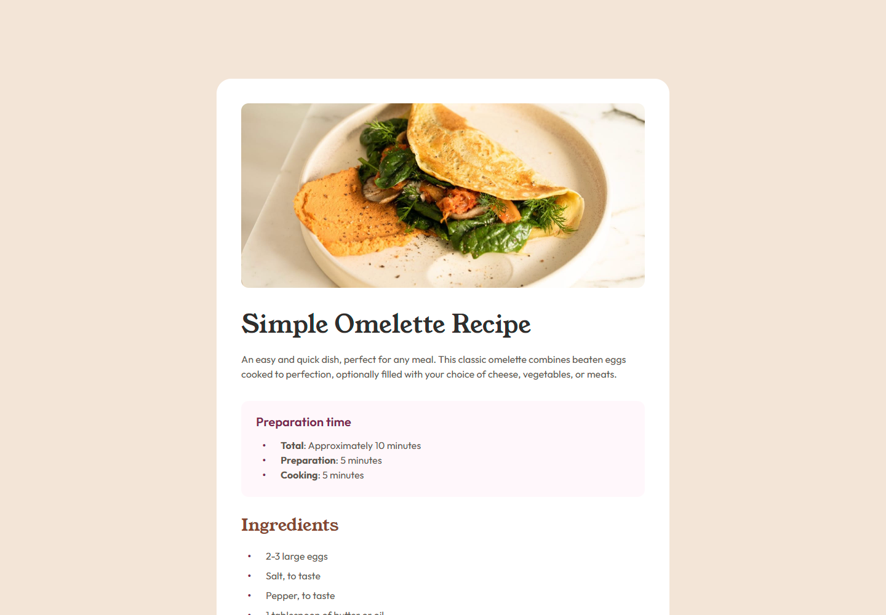

# Frontend Mentor - Recipe page solution

This is a solution to the [Recipe page challenge on Frontend Mentor](https://www.frontendmentor.io/challenges/recipe-page-KiTsR8QQKm). Frontend Mentor challenges help you improve your coding skills by building realistic projects. 

## Table of contents

- [Overview](#overview)
  - [The challenge](#the-challenge)
  - [Screenshot](#screenshot)
  - [Links](#links)
- [My process](#my-process)
  - [Built with](#built-with)
  - [What I learned](#what-i-learned)
  - [Continued development](#continued-development)
- [Author](#author)

## Overview

### Screenshot

### Links

- Solution URL: [Link](https://github.com/RicardoGeada/fm-recipe-page-profile)
- Live Site URL: [Link](https://ricardogeada.github.io/fm-recipe-page-profile/)

## My process

### Built with

- [React](https://reactjs.org/) - JS library
- TypeScript
- SCSS
- Jest

### What I learned

During this project, I deepened my understanding of various HTML tags and how to use them effectively in a real-world context. I explored the structure and semantics of HTML more thoroughly and applied different tags to create a more accessible and well-structured layout.

### Continued development

In the future, I want to expand my knowledge of HTML even further by learning about additional tags and understanding their specific use cases. My goal is to apply this knowledge to build more advanced, semantic, and accessible web applications.

## Author

- Website - [ricardogeada.com](https://www.ricardogeada.com)
- Frontend Mentor - [@RicardoGeada](https://www.frontendmentor.io/profile/RicardoGeada)
